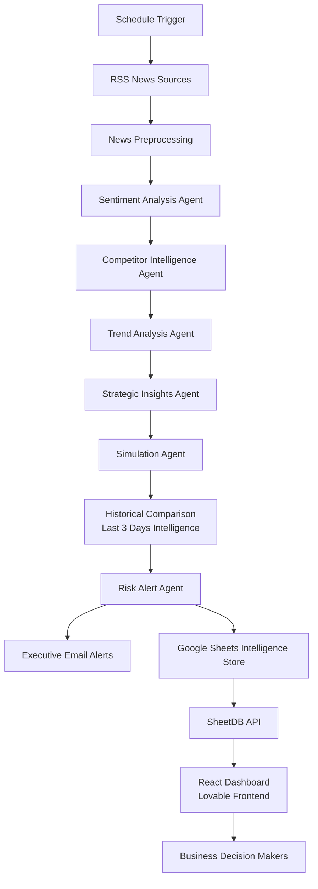

🚀 AI-Powered Strategic Market Intelligence Network
Transforming Static Market Reports into Dynamic AI-Driven Strategic Intelligence

An Agentic Multi-Agent Market Intelligence Platform that continuously monitors market signals, analyzes competitors, predicts business outcomes, assesses risks using historical intelligence, and delivers real-time strategic recommendations through an interactive dashboard and executive alerts.

**🌐 Live Dashboard**

Dynamic Market Intelligence Dashboard

Frontend:
https://mani1324.lovable.app/

**N8N AGENTIC AI WORKFLOW**

**INSIGHTS DASHBOARD**

**📌 Project Overview**

Traditional businesses depend on static reports that quickly become outdated.

This project replaces those reports with an AI-powered multi-agent intelligence network capable of continuously collecting market information, analyzing trends, comparing historical performance, evaluating risks, and recommending strategic business actions automatically.

**Instead of reading lengthy reports, business leaders receive:**

📈 Live market intelligence
📊 Strategic dashboards
🚨 Automated executive alerts
🤖 AI-generated recommendations
📉 Historical risk comparisons
🎯 Future business simulations
🎯 Problem Statement

**Businesses today rely on:**

Static market reports
Manual competitor analysis
Delayed strategic decisions
Disconnected market signals

**This results in:**

Slow decision making
Missed opportunities
Poor risk visibility
Reactive business strategies

Our solution builds an Agentic Market Intelligence Network that continuously generates evolving business intelligence instead of static reports.

**💡 Solution**

The platform consists of multiple AI agents working together as an autonomous strategic intelligence network.

Each agent specializes in one business function and collaborates with other agents to generate executive-level insights.

**🏗 System Architecture**

**🤖 AI Agent Workflow**
**1️⃣ Trend Agent**
Responsibility

Analyzes aggregated market news to identify:

Emerging trends
Market direction
Hot topics
Industry movements
Output
Emerging Trends
Trend Direction
Hot Topics

**2️⃣ Sentiment Analysis Agent**

Analyzes every news article to determine:

Overall sentiment
Confidence score
Reasoning

Outputs:

Positive
Neutral
Negative
Confidence
Explanation

**3️⃣ Competitor Intelligence Agent**

Identifies

Companies
Products
Sector
Competitor landscape

Generates:

Competitor insights
Industry positioning
Market players

**4️⃣ Strategic Insights Agent**

Combines information from

Trend Agent
Sentiment Agent
Competitor Agent
Latest News

Produces:

Business Impact
Strategic Recommendations
Opportunities
Sector Insights
Executive Summary

**5️⃣ Simulation Agent**

Predicts future outcomes for each strategic recommendation.

Generates:

Expected Outcomes
Success Probability
Business Impact
Overall Prediction

**6️⃣ Risk Alert Agent**

The intelligence engine of the project.

Analyzes

Strategic insights
Simulation results
Market trends
Historical intelligence (last 3 days)

Produces:

Risk Score
Risk Level
Historical Comparison
Risk Trend
Risk Factors
Executive Reasoning
Alert Decision

**📅 Historical Intelligence**

Unlike traditional dashboards, this system compares the current day's intelligence against the previous three days.

It identifies:

Risk increase
Risk decrease
Trend movement
Historical comparisons
Strategic evolution

This enables businesses to understand whether conditions are improving or deteriorating over time.

**📊 Dynamic Dashboard**

The frontend dashboard is built using Lovable AI and displays live data retrieved from Google Sheets via SheetDB. Lovable generates production-ready React applications and supports API integration, making it suitable for rapidly building dynamic dashboards.

**Dashboard Features include:**

Executive Overview
Current Risk Score
Risk Level
Alert Status
Executive Summary
Market Intelligence
Emerging Trends
Trend Direction
Hot Topics
Business Impact
Sector Intelligence
Sector Insights
Companies
Key Players
Products
Strategic Intelligence
Opportunities
Recommendations
Executive Actions
Simulation Analytics
Expected Outcomes
Success Probability
Overall Prediction
Historical Intelligence
Historical Comparison
Risk Trend
Previous Assessments
Executive Alerts
High Risk Alerts
Medium Risk Updates
Low Risk Reports
📧 Automated Email Alerts

The system automatically sends professionally formatted HTML reports.

**High Risk Alert**

Contains:

Executive Summary
Historical Comparison
Risk Assessment
Strategic Opportunities
Simulation Results
Recommended Actions
Immediate Executive Intervention
Market Intelligence Report

Contains:

Daily Intelligence Summary
Business Impact
Opportunities
Recommendations
Predicted Outcomes
Market Trends
Executive Insights
📂 Data Storage

Daily intelligence is stored in Google Sheets.

Each row represents one day's complete market intelligence.

**Stored fields include:**

Timestamp
Market Trends
Business Impact
Recommendations
Risk Score
Risk Level
Historical Comparison
Risk Trend
Companies
Products
Sector
Opportunities
Summary
Action
Expected Outcome
Success Probability
Overall Prediction
Sentiment
Confidence

This historical repository enables continuous business intelligence and trend comparison.

**⚙ Workflow Automation**

Built using n8n.

Automation includes:

RSS ingestion
News preprocessing
AI agent execution
Historical comparison
Risk evaluation
Google Sheets updates
Email notifications
Dashboard synchronization

**🛠 Tech Stack**
Frontend
React
TypeScript
Tailwind CSS
Lovable AI
Workflow Automation
n8n
AI
Groq LLM
Multi-Agent Architecture
Data Storage
Google Sheets
API
SheetDB API
Notifications
Gmail API
Deployment
Lovable Deployment
Google Cloud Services

**📈 Key Features**
AI Multi-Agent Architecture
Automated Market Monitoring
Strategic Intelligence Generation
Historical Risk Comparison
Dynamic Dashboard
Executive Email Reports
Competitor Analysis
Sentiment Analysis
Simulation-Based Predictions
Business Opportunity Detection
Daily Automated Updates
No Manual Reporting Required

**📊 Innovation**

Unlike conventional business dashboards, this platform:

Continuously learns from new market data
Compares historical intelligence
Simulates business outcomes
Generates executive recommendations
Produces dynamic business intelligence instead of static reports
🎯 Real-World Applications

**Suitable for:**

Startups
Enterprise Strategy Teams
Business Analysts
Investors
Product Managers
Government Agencies
Market Research Firms

**🔮 Future Enhancements**
PDF Executive Reports
WhatsApp Alerts
Slack Integration
Microsoft Teams Notifications
Predictive Forecasting
Custom AI Chatbot
Voice Assistant
Multi-language Support
User Authentication
Interactive Business Analytics
Advanced Visualizations

**📷 Project Workflow**
                    AI-POWERED MARKET INTELLIGENCE NETWORK

┌──────────────────────────────┐
│ 1. Schedule Trigger          │
└──────────────┬───────────────┘
               │
               ▼
┌──────────────────────────────┐
│ 2. Collect Latest Market News│
│    (RSS Feeds)               │
└──────────────┬───────────────┘
               │
               ▼
┌──────────────────────────────┐
│ 3. Preprocess News Articles  │
└──────────────┬───────────────┘
               │
               ▼
┌────────────────────────────────────────────────────┐
│            AI Multi-Agent Processing               │
│                                                    │
│ • Sentiment Analysis Agent                         │
│ • Competitor Intelligence Agent                    │
│ • Trend Analysis Agent                             │
│ • Strategic Insights Agent                         │
│ • Simulation Agent                                 │
│ • Historical Risk Comparison (Last 3 Days)         │
│ • Risk Alert Agent                                 │
└──────────────┬─────────────────────────────────────┘
               │
               ▼
┌──────────────────────────────┐
│ 4. Store Intelligence        │
│    (Google Sheets Database)  │
└──────────────┬───────────────┘
               │
        ┌──────┴───────────────┐
        │                      │
        ▼                      ▼
┌──────────────────┐   ┌──────────────────────┐
│ Email Alerts     │   │ SheetDB API          │
│ (High / Low Risk)│   │ Dynamic Data Access  │
└────────┬─────────┘   └──────────┬───────────┘
         │                        │
         │                        ▼
         │             ┌────────────────────────┐
         │             │ React Dashboard        │
         │             │ (Lovable Frontend)     │
         │             └──────────┬─────────────┘
         │                        │
         └──────────────┬─────────┘
                        ▼
          ┌──────────────────────────────┐
          │ Real-Time Strategic Market   │
          │ Intelligence for Businesses  │
          └──────────────────────────────┘

👨‍💻 Developed By

G.Chandra Mani Shankar

AI | Multi-Agent Systems | Market Intelligence | Business Analytics | Workflow Automation

**⭐ Project Vision**

"Transforming static market reports into an autonomous, AI-driven Strategic Market Intelligence Platform that empowers businesses with real-time insights, predictive intelligence, historical context, and actionable recommendations for smarter decision-making."

